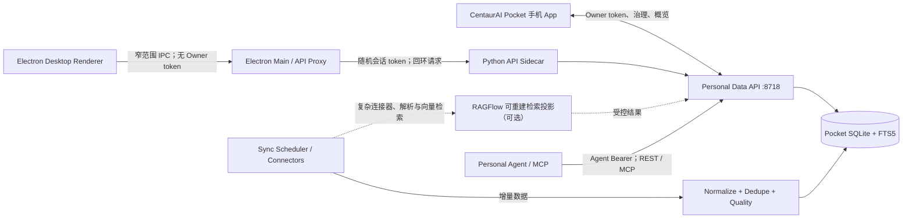
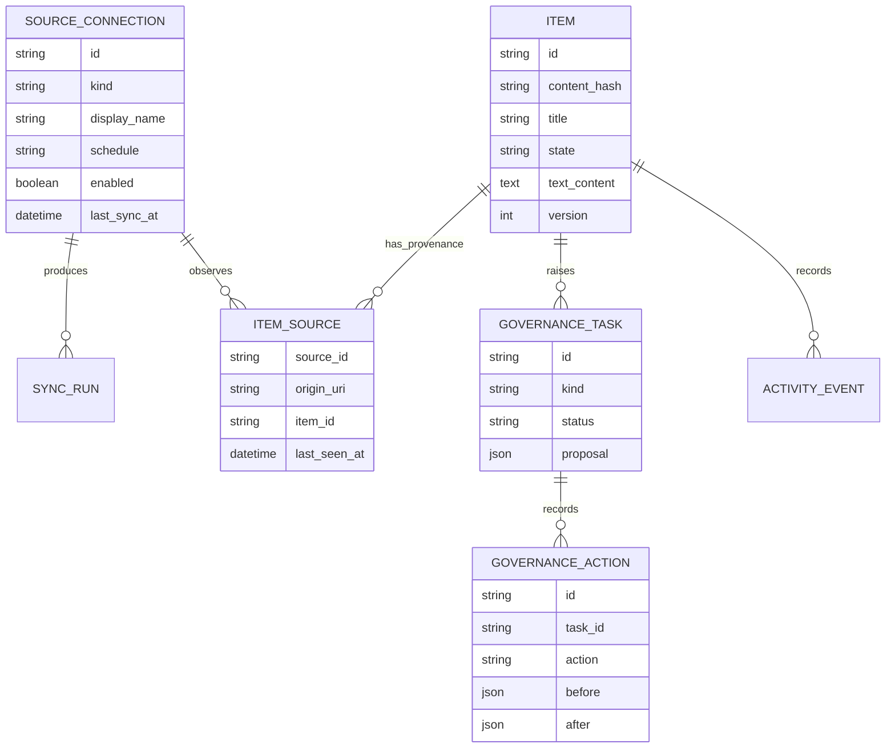

# 系统架构

## 总体结构



Android/iOS 手机 App 是 Pocket 的主要用户入口，也是个人版的正式交付形态；
它负责采集、概览和治理，但不是后台同步服务器。连接器、解析、索引和调度都在
私人服务端执行。

Electron 只作为本机辅助预览和 sidecar 启动壳，复用同一套 Expo Web 界面，
不代替手机 App。其 Renderer 不直接持有 Owner
凭据，也不直接访问 API。Main process 每次启动生成随机会话 token，通过私有
继承管道确认自己启动的 sidecar 已成功绑定 8718，再代理当前 UI 所需的白名单
接口。端口已有监听者时桌面模式直接拒绝启动，不尝试接管。

## 组件

### Mobile App

- Expo SDK 57、React Native、Expo Router。
- `ai.centaur.pocket` 独立应用身份。
- SecureStore 保存 Owner token。
- 原生端持久化队列使用 AES-GCM-256 加密，密钥保存在 SecureStore；Web 预览为浏览器本地明文存储。
- 今日、治理、来源和设置四个主要入口。
- 系统分享在 Android/iOS development 或 production build 中接收文字与网页 URL；文件、图片和 PDF 未实现。Web 版用于快速验证 UI。

### Electron Desktop

- Desktop App ID 为 `ai.centaur.pocket.desktop`；与移动包名
  `ai.centaur.pocket` 区分。
- 本地内容由 `centaur-pocket://app` 自定义安全协议提供，导航、下载、新窗口和
  网页权限默认拒绝。
- Preload 只暴露启动配置与白名单 Pocket API 请求；不暴露 Node、文件系统、
  shell、进程、任意 URL 或原始 IPC；另有一个只返回用户选择结果的原生目录
  选择器。
- Main 生成每次启动随机的 Owner 会话 token；真实值不进入 Renderer、
  LocalStorage 或 DevTools。
- PyInstaller sidecar 通过 FD 3 私有管道返回 PID、端口和随机 nonce，Main
  验证后才开始健康检查；公开 `/health` 不能证明进程归属。
- 新建文件夹来源必须匹配 Main 原生选择器持久化批准的绝对路径，Renderer 不能
  仅靠构造 `POST /sources` 扫描其他宿主目录。
- 当前 CentaurOS 便携启动受 AppArmor 限制，Chromium 进程 sandbox 实际关闭，
  由强制 bubblewrap 提供外层、只读为主的文件系统约束；这不是正式系统安装包
  中 Chromium sandbox 的等价替代。

### Personal Data API

- FastAPI 单一权威实现。
- API 前缀 `/api/v1`。
- SQLite 负责领域数据、同步历史、活动和 FTS5 索引。
- 不含 tenant、workspace、role、group、reviewer 或 resource grant。
- Owner 接口与 Agent 只读接口使用不同凭据。
- REST Agent 查询与 MCP 都由 8718 上的同一 FastAPI 服务提供；8720 仅预留，MVP 没有独立 Gateway 进程。

### Sync and Governance

- 当前 Folder Connector 只负责列举服务端文件和读取内容；未来远端 Connector 才各自管理授权与游标。
- Sync Run 记录每次运行计数、错误和起止时间；当前表结构没有持久化远端游标字段。
- 内容指纹独立于路径；路径变化不会重复制造内容。
- 规范化和质量规则生成 Governance Task。
- 完整成功扫描会清理失效来源映射；尚未归档的条目失去最后来源时生成 deletion 卡，不直接归档。旧 pending review 会先结束，避免孤立内容被误开放。
- 安全、确定的修复可自动执行；涉及语义判断和破坏性变更时等待手机确认。普通 review apply 进入 ready，deletion apply 只能进入 archived。

### Workspace 备忘物化（P1c-A）

前端只能对已从 Pocket 同步、处于可物化状态的备忘展示确定性、可解释建议；建议不会
触发服务端写入。主人点击并确认表单后，客户端调用 memo 专用的 task 或 calendar
命令，同时提交 `If-Match`、body CAS、幂等键和设备 ID。Owner token 与已配对且
`X-Device-ID` 匹配的 Owner Device 都可调用，设备会话只允许 `ws_default`。

一次物化在同一 SQLite 事务内完成以下顺序：

```text
校验 live/active/confirmed memo 与 CAS
  → 服务端派生并创建 task 或内部 calendar entry
  → memo active → converted，version + 1
  → 写入 v5 immutable materialization ledger
  → 追加 task.created 或 calendar.created
  → 追加 memo.updated
  → 保存幂等复合响应并提交
```

task 的 domain、source、issuer、acceptance owner、初始 stage/health 和
`origin_memo_id` 由服务端派生；calendar 的 domain、`memo_id`、scheduled 状态、空
attendees 及空外部标识由服务端派生。Pocket 日程只用于内部执行安排，不表示已同步到
外部日历，也不发送邀请。个人备忘交给非 Owner 承办时必须明确确认；这个确认只覆盖
任务表单字段，原始正文、source ref 和 excerpt 不进入承办人的 scoped 协议视图。

schema v5 账本以 memo 为主键并强制 task/calendar 二选一，保存转换前版本和不含正文/
excerpt 的来源摘要。数据库触发器锁定账本、converted memo 与目标关联，通用 task/
calendar 创建入口也拒绝 memo 关联字段。旧版缺少完整原子事件和 disclosure 证据，迁移
不会回填任何历史 task/calendar 链接；发现任一旧链接或任一无账本的 converted memo
即诊断并整体 fail closed。只有清洁库才创建空账本，绝不靠关联列补造审计证明。

### IM 数据源与证据

IM 使用独立于文件条目的领域模型。企业微信官方会话内容存档是企业授权场景的权威
采集方向；当前仓库包含官方 C SDK 的分页、解密和规范化骨架，但生产 Source、持久
游标、媒体与后台任务尚未接通。个人微信使用 Firefox 可见 DOM 扩展和本机 Native
Messaging Host，只观察 `wx.qq.com` 当前会话已经真实渲染的节点。

网页观察器通过一次性配对码换取来源专用 Collector token。服务端记录浏览器 session、
心跳和登录失效、未打开会话、解析降级等覆盖缺口；这些缺口不会被误写成“期间没有
消息”。消息进入会话、身份、版本、附件引用和证据模型，并可生成决定、承诺、任务的
待确认候选。新会话的 `agent_enabled` 默认关闭，只有 Owner 明确修改会话策略后才可
进入 Agent 使用范围。

完整的覆盖语义、安装和数据模型见
[IM 数据源、治理与微信网页观察器](im-data-sources.md)。

### RAGFlow Engine Adapter（可选检索投影）

当前仓库没有 RAGFlow 运行时依赖，也没有自动投影 worker。已实现的可选 HTTP 适配器
可以查找或创建私有 dataset、创建空文档、添加手工 chunk 和发起检索；
`ragflow_projections` 保存 Pocket 候选到 dataset/document/chunk 的映射。RAGFlow
只作为可重建的无头检索引擎，不是 Pocket 的领域数据库：

- 只投影经过治理且会话策略允许的知识，不默认复制全部原始聊天。
- 检索命中必须返回 Pocket 再校验当前状态并补回消息级证据。
- dataset 损坏或丢失时从 Pocket 重建，不能把 chunk 反向当作权威事实。
- API key、内部 dataset 和 chunk 标识留在适配边界，不进入 Agent 业务契约。

Pocket 不 import 企业 DataHub 的治理模块，也不复制其 Python/Go 两套策略判断。RAGFlow 不可用时，本机文件夹、SQLite/FTS5、手机治理和 Agent 基础检索仍可工作。

## 领域模型



实际 MVP 把当前内容、状态和递增版本号内联在 `items` 表中；`item_sources` 保存来源映射。源文件内容变化时，新指纹先形成待治理 generation，上一代 `ready` 条目继续可查；确认新 generation 时再归档旧条目。独立版本表是未来升级方向，不是当前表结构。

## 一致性规则

1. 每次同步都有唯一 Sync Run。
2. 当前连接器发现的新数据写入 `needs_review`，并同时生成 pending 治理任务。
3. 指纹、规范化和质量检查在同一条目切换 ready 前完成。
4. 已实现幂等记录的创建、同步、采集和治理动作遇到重复 idempotency key 时返回原结果，不重复执行。
5. 文件条目 Agent 查询固定过滤 `state = ready`；IM 受会话默认关闭门控制，知识结果
   还要求候选为 `confirmed`。原始消息入库不代表 Agent 可见。
6. 更新失败时保留 last-ready generation。
7. 活动记录面向用户可读，不承担企业合规审计职责。
8. P1c-A 备忘只能经专用命令物化一次；目标事件先于 `memo.updated`，复合响应 ETag
   固定对应转换后 memo，账本、资源、事件和幂等响应必须同事务提交。

超级秘书的 P1b-A 任务协议使用独立的 v4 渐进迁移：case 指向当前 revision，revision
保存 NFC/LF/UTC 规范化完整文档与 SHA-256 摘要，decision 只追加；数据库触发器拒绝
revision/decision 的 UPDATE 和 DELETE。邀请可绑定冻结 revision，承办人 scoped session
只保存 token hash 并限定单 task/case/device。Owner token、Owner-device、旧双渠道能力和
task session 分别记录真实 assurance method；后两者仅是 A1 能力持有证明，不代表实名
身份或电子签名。旧 v3 未绑定邀请保持兼容，系统不反推历史证明。

Owner 经 Workspace 任务路由发现 case，Owner/受管 Owner 设备与任务会话再经
`/api/v1/task-agreements/{case_id}` 读取或回应。写入同时校验 case ETag/version、
revision ID/digest、当前回应方、幂等键和设备 ID。accept 才在同一事务把精确
revision 应用到任务；reject 不改变 `issued` 任务；counter 写入完整 N+1 revision 并
翻转回应方。待回应或已接受协议的字段不能绕过该聚合直接修改；发现真实
字段/成员漂移时会标记 stale 并撤销邀请与会话。

`POST /api/v1/task-alignments/exchange` 把邀请路径+短码换成最长 10 分钟、无
refresh 的 `cp_task_at_` token；认证分派按 token 前缀 fail closed，不会回退成
Owner/手机会话。它仅能访问绑定的 task/case/assignee，不能访问其他任务、
Workspace 通用数据、邮件或文档。token 由数据根中独立持久的任务会话 key 做域分离
HMAC 确定性生成，库内只存 token hash；该 key 首次升级会从当时 Owner
secret 受控引导一次，之后不再由当前 Owner token 派生，与 Owner token 轮换解耦，
并必须与数据库作为同一备份恢复集。会话 live 且协议 current 时，任意同
key/body 重试返回同 token/session/
expiry，不延寿也不重复审计。closed/revoked session 不再恢复。单 revision 规范 JSON
最多 3 MiB，单 case 累计最多 4 MiB/100 revisions/100 decisions，敏感 JSON 请求体
最多 8 MiB。

P1b-B 使用 workspace schema v6 的独立任务变更聚合。v6 在原
`secretary_task_changes` 主记录外增加 proposal、invitation、session、decision 表；
proposal 和 decision 由数据库触发器拒绝 UPDATE/DELETE，主记录状态转换还必须存在
digest、角色和会话绑定正确的决定。每个任务同时最多一个 protocol-bound pending
change，防止不同 change type 并行建立互相冲突的任务基线。v4 的 P1b-A 和 v5 的 memo
materialization ledger 仍按各自历史引入版本保留。

提案文档 schema 固定为 `centaur.task-change.v1`，只允许 `assignee`、`due_at`、
`acceptance_criteria`、`abnormal_close` 四类 exact patch，并精确包含 13 个顶层字段：
任务/change 标识与基线版本、提议/回应角色和成员、当前值、patch、原因及 schema。
规范化器递归执行 NFC、CRLF/CR → LF、UTC 秒精度和排序 key 紧凑 JSON，再计算
SHA-256；协议读取时重新规范化并比较 canonical bytes 与 digest，额外字段、类型错误、
摘要或记录绑定异常都 fail closed。

任务 issuer 是提议方，提案时的当前 assignee 是冻结回应方。主人自办任务由 Owner
凭 Owner token 或绑定设备会话显式接受/拒绝；外部任务的 Owner 不能代答，只能创建
双通道邀请或带理由取消。外部回应方通过链接与独立 code 换取最长 10 分钟、无 refresh、
绑定 change/task/responder/device 的 `cp_task_ch_` session；认证分派不会回退为
P1b-A、Owner 或手机凭据。code 与 token 只存 hash，公开页在 code 验证前不返回任务
内容，scoped 投影也不包含 memo/source/excerpt、联系方式、邮件或文档。

回应写入要求 change `If-Match`/expected version、task expected version、proposal digest、
设备、幂等键和 client mutation ID 全部匹配。accept 在同一事务写 append-only decision、
应用 patch、更新 task/change、撤销邀请与会话并追加事件；reject 不改任务，cancel 只能
由提议方执行。承办人变更接受后任务回到 `issued`，并要求新承办人重新走 P1b-A。
同 actor/key/body 并发或重试只重放一个结果。

v5→v6 迁移只在没有历史 pending task change 且没有无 marker 同名对象时创建新对象；
随后结构化校验表、索引、触发器和已有绑定。伪造 v6 marker、弱同名表或无法补造确认
依据的 `status=proposed` 旧记录都会阻止启动。升级不为已经关闭的历史 change 补造
proposal/decision，因此它们保留原状态但不获得 P1b-B 追溯证明。

workspace schema v7 在 task 上增加单调 `assignment_epoch`，并建立 external execution
invitation、access session、refresh family 和一次性 refresh token 四类对象。邀请只对
当前已完成 P1b-A 的 external assignee 签发；交换产生 10 分钟 `cp_task_ex_` access 与
24 小时 idle、最长 7 天绝对期限的 `cp_task_er_` refresh 链。access/refresh 明文不落库，
token 由同一独立持久任务会话 key 的不同域生成。refresh 原子旋转 access 和 refresh；
精确短窗口重试可重放首次旋转结果，其他旧 refresh 重用会撤销整个 family 并追加
security event。

执行投影只暴露任务执行所需字段、本人最近 check-in 与步骤图；不包含成员联系方式、
memo/source/evidence、邮件或文档。执行视图 ETag 同时覆盖 task version、assignment
epoch、step versions、check-in cursor 和 pending changes。承办人可启动已对齐任务、
追加本人 check-in、更新本人负责的步骤并提交验收；Owner 仍负责退回返工或最终接受。
存在 pending P1b-B change 时 start/step/submit 关闭，但 check-in 保留。换人必须使
`assignment_epoch + 1`，任务终态/删除、换人和成员停用由数据库触发器撤销全部执行能力；
运行时还校验任务期限宽限、stage、成员与设备绑定。

可选 browser BFF 与 JSON 执行 API 运行在同一 FastAPI 进程，但只有配置规范 HTTPS
public Origin 时才安装。它输出无脚本、nonce CSP 的同源表单，用 path-scoped
`Secure`/`HttpOnly`/`SameSite=Strict` Cookie 分离 boot、access 和 refresh，并用签名
CSRF 绑定 family/task/assignment epoch/credential generation/action/执行视图 ETag。
每个 POST 还要求精确 Origin 与 same-origin navigation Fetch Metadata。BFF 位于通用
CORS 外层，删除 `Access-Control-*` 并拒绝 `OPTIONS`；access 到期只给出显式
session-continue/refresh 表单，不运行脚本或静默续期。

v7 迁移对表、索引和触发器执行精确 DDL 摘要与结构化绑定校验；伪造 marker、弱同名
对象、可空/不单调 assignment epoch 或 token 链绑定异常都阻止启动。当前最高
workspace schema 为 v7；v4/v5/v6 仍分别表示其协议对象的历史引入版本。

P1b-A/P1b-B 与 external execution 的双通道技术控制仍只提供 A1 能力持有保证。Owner
从创建邀请的响应中同时获得路径和短码，因此系统无法仅凭该流程区分 Owner 与某个真实承办人。自然人/
企业身份、授权代理与法律签名都不在该保证内；WebAuthn/设备持有证明和组织 IdP
是未来增强层。

execution event 把能力 session 作为实际 actor subject，并另存
`on_behalf_of_member_id`、`assurance_method` 与 `assignment_epoch`。task 的
`updated_by`、check-in 的 `created_by` 是业务上的逻辑归属，不是对自然人的不可抵赖
认证。任务/人员分析必须按 event-level assurance 加权，不能把 A1 能力持有事件等价成
实名或强设备认证事件。

任务分析首版是只读派生，不升级 workspace schema。`workspace/analytics.py` 在同一 SQLite
读事务中把任务结果与人员归属证据分开：结果使用任务/check-in/步骤/变更业务事实；归属
只接受绑定正确的不可变 decision 或 typed execution event。历史普通 actor/created_by/
updated_by 不推成 A2。输出按动作维度保留 raw count、A2/A1/A0、assignment epoch 和
服务端 basis-point 折算，同时给出 coverage/完整性缺口；不跨动作生成总分或排名，也不
返回原始事件、设备、session、联系人方式或正文。
同一 decision 的重复事件引用整组降为 A0；typed 错绑不会回显 payload 声称的成员，也不
累计其 assignment epoch。撤销按事件时点判断而不追溯抹除历史合法动作，expiry 使用严格
半开边界。步骤元数据维护、日程状态传播和旧含混步骤事件不作为执行动作。

## 安全边界

- 服务默认监听 `127.0.0.1:8718`。
- 未设置环境变量时，Owner 与 Agent token 以明文 secret 文件保存在 Pocket 私有数据目录；目录尝试设置为 `0700`，文件尝试设置为 `0600`。当前实现不是数据库 hash 存储。
- Owner token 没有配对或在线轮换 API：可由环境变量托管，或替换 `owner-token` 后重启服务。
- Agent 元数据接口只返回前缀与管理模式。自动生成的单一 Agent token 可在线轮换，轮换响应返回一次完整新值，旧值立即失效；环境变量托管模式需改变量并重启。
- 微信网页观察器使用独立 Collector token。配对码和 Collector token 在服务端只保存
  摘要；明文 token 只由本机 Native Host 以 `0600` 保存。Host 不接收 Owner token，
  并且只连接明确的 `http://127.0.0.1:<port>`。
- CORS 只允许 `CENTAURAI_POCKET_CORS_ORIGINS` 中逗号分隔的精确 Origin。MCP 请求若带 `Origin`，端点还会再次按同一白名单校验以降低 DNS rebinding 风险。external execution BFF 不使用该 CORS 能力，始终同源且拒绝预检。
- `cp_task_at_` 任务会话仅对单一协议开放 scoped GET/response，必须与
  `X-Device-ID` 匹配；对 Workspace、邮件、文档或其他任务一律拒绝。
- `cp_task_ex_` access 与 `cp_task_er_` refresh 只绑定单一 task/assignee/
  assignment epoch/device；refresh reuse、终态、删除、换人或成员停用会撤销整个执行
  family。所有任务 token 域共用的数据根持久 key 必须与数据库成对备份恢复。
- 跨设备访问应使用可信 HTTPS，并限制在可信局域网或私有 VPN 内；不要直接把 8718 暴露到公网。

## 运行隔离

| 项目 | API | Agent/MCP | 数据根 |
| --- | ---: | ---: | --- |
| 旧 `centaurAI-database` | 8618 | 8620 | 原项目自己的 Chroma/Wiki/Memory 目录 |
| CentaurAI Pocket | 8718 | 8718（MCP 同端口）；8720 仅预留 | `~/.local/share/centaurai-pocket` |
| 企业 DataHub/RAGFlow | 保持现有部署 | 保持现有部署 | 保持现有卷 |
