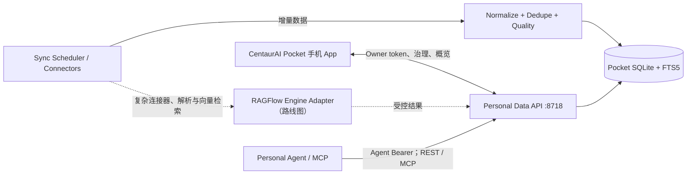
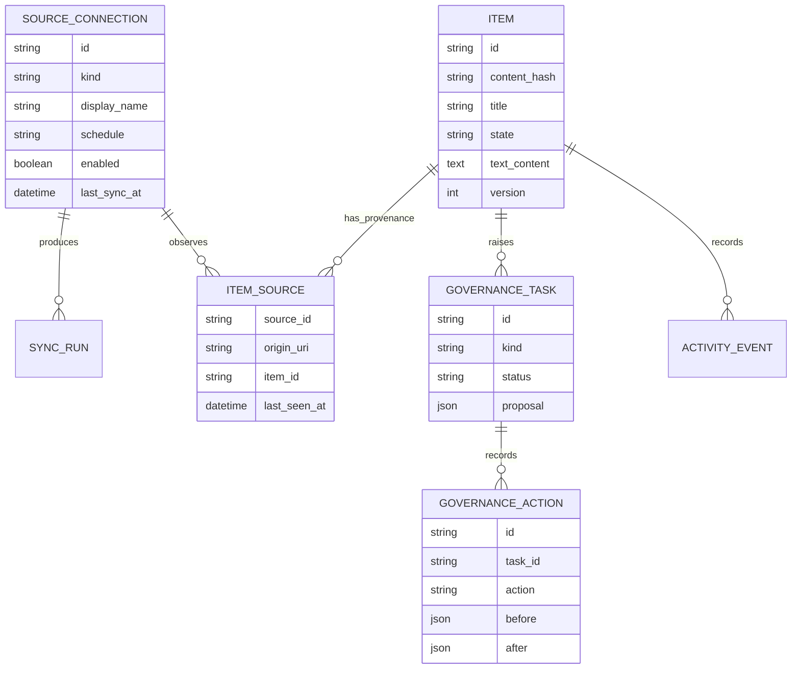

# 系统架构

## 总体结构

手机是治理遥控器，不是后台同步服务器。连接器、解析、索引和调度都在私人服务端执行。

## 组件

### Mobile App

- Expo SDK 57、React Native、Expo Router。
- `ai.centaur.pocket` 独立应用身份。
- SecureStore 保存 Owner token。
- 原生端持久化队列使用 AES-GCM-256 加密，密钥保存在 SecureStore；Web 预览为浏览器本地明文存储。
- 今日、治理、来源和设置四个主要入口。
- 系统分享在 Android/iOS development 或 production build 中接收文字与网页 URL；文件、图片和 PDF 未实现。Web 版用于快速验证 UI。

### Personal Data API

- FastAPI 单一权威实现。
- API 前缀 `/api/v1`。
- SQLite 负责领域数据、同步历史、活动和 FTS5 索引。
- 不含 tenant、workspace、role、group、reviewer 或 resource grant。
- Owner 接口与 Agent 只读接口使用不同凭据。
- REST Agent 查询与 MCP 都由 8718 上的同一 FastAPI 服务提供；8720 仅预留，MVP 没有独立 Gateway 进程。

### Sync and Governance

- 当前 Folder Connector 只负责列举服务端文件和读取内容；未来远端 Connector 才各自管理授权与游标。
- Sync Run 记录每次运行计数、错误和起止时间；当前表结构没有持久化远端游标字段。
- 内容指纹独立于路径；路径变化不会重复制造内容。
- 规范化和质量规则生成 Governance Task。
- 完整成功扫描会清理失效来源映射；尚未归档的条目失去最后来源时生成 deletion 卡，不直接归档。旧 pending review 会先结束，避免孤立内容被误开放。
- 安全、确定的修复可自动执行；涉及语义判断和破坏性变更时等待手机确认。普通 review apply 进入 ready，deletion apply 只能进入 archived。

### RAGFlow Engine Adapter（未来扩展）

当前仓库没有 RAGFlow 运行时依赖或已启用的适配器。未来若接入，RAGFlow 只作为可插拔无头引擎，不是 Pocket 的领域数据库；适配器将负责：

- 将 Source Connection 映射到 RAGFlow connector。
- 将 Pocket item/version 映射到 document/chunk/task。
- 获取解析状态和检索结果。
- 把 RAGFlow 的内部 tenant/dataset 标识隐藏在适配层。

Pocket 不 import 企业 DataHub 的治理模块，也不复制其 Python/Go 两套策略判断。RAGFlow 不可用时，本机文件夹、SQLite/FTS5、手机治理和 Agent 基础检索仍可工作。

## 领域模型

实际 MVP 把当前内容、状态和递增版本号内联在 `items` 表中；`item_sources` 保存来源映射。源文件内容变化时，新指纹先形成待治理 generation，上一代 `ready` 条目继续可查；确认新 generation 时再归档旧条目。独立版本表是未来升级方向，不是当前表结构。

## 一致性规则

1. 每次同步都有唯一 Sync Run。
2. 当前连接器发现的新数据写入 `needs_review`，并同时生成 pending 治理任务。
3. 指纹、规范化和质量检查在同一条目切换 ready 前完成。
4. 已实现幂等记录的创建、同步、采集和治理动作遇到重复 idempotency key 时返回原结果，不重复执行。
5. Agent 查询固定过滤 `state = ready`。
6. 更新失败时保留 last-ready generation。
7. 活动记录面向用户可读，不承担企业合规审计职责。

## 安全边界

- 服务默认监听 `127.0.0.1:8718`。
- 未设置环境变量时，Owner 与 Agent token 以明文 secret 文件保存在 Pocket 私有数据目录；目录尝试设置为 `0700`，文件尝试设置为 `0600`。当前实现不是数据库 hash 存储。
- Owner token 没有配对或在线轮换 API：可由环境变量托管，或替换 `owner-token` 后重启服务。
- Agent 元数据接口只返回前缀与管理模式。自动生成的单一 Agent token 可在线轮换，轮换响应返回一次完整新值，旧值立即失效；环境变量托管模式需改变量并重启。
- CORS 只允许 `CENTAURAI_POCKET_CORS_ORIGINS` 中逗号分隔的精确 Origin。MCP 请求若带 `Origin`，端点还会再次按同一白名单校验以降低 DNS rebinding 风险。
- 跨设备访问应使用可信 HTTPS，并限制在可信局域网或私有 VPN 内；不要直接把 8718 暴露到公网。

## 运行隔离

| 项目 | API | Agent/MCP | 数据根 |
| --- | ---: | ---: | --- |
| 旧 `centaurAI-database` | 8618 | 8620 | 原项目自己的 Chroma/Wiki/Memory 目录 |
| CentaurAI Pocket | 8718 | 8718（MCP 同端口）；8720 仅预留 | `~/.local/share/centaurai-pocket` |
| 企业 DataHub/RAGFlow | 保持现有部署 | 保持现有部署 | 保持现有卷 |
