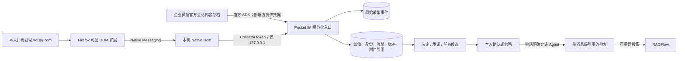

# IM 数据源、治理与微信网页观察器

本文说明 CentaurAI Pocket 对 IM 数据的定位、两类采集通道、数据可信度、治理
门槛，以及 Firefox 微信网页观察器的本机安装和排错方法。

这里的“权威”只描述**采集链路和来源证明强度**，不表示聊天内容天然真实、合法，
也不表示它已经经过用户确认。聊天记录仍可能包含玩笑、转述、撤回、过期安排和错误
信息，必须保留原消息证据并经过治理。

## 1. 实现状态与定位

| 通道 | 定位 | 当前实现状态 | 覆盖保证 |
| --- | --- | --- | --- |
| 企业微信会话内容存档 | 企业场景的权威采集源 | 已有官方 C SDK 的加载、分页拉取、解密和中立事件规范化骨架；尚未接入 Source API、持久游标、媒体下载和后台调度 | 以企业已合法开通的存档范围及官方接口实际返回为准 |
| 个人微信 Firefox 可见 DOM 观察器 | 本人主动运行的 best-effort 旁路来源 | 数据源、配对、Native Host、Firefox 扩展、心跳、覆盖缺口、消息入库和手机状态界面已实现 | 只覆盖 `wx.qq.com` 当前会话中真实渲染且能可靠识别的节点，不是完整历史 |
| 手工导入或未来其他连接器 | 用户提供的补充来源 | IM 表已预留 `user_provided` 权威级别；本轮没有聊天文件导入器 | 取决于用户提供内容及导入器能力 |

因此，生产优先级应是：企业微信官方存档用于企业授权范围内的完整性要求；个人微信
观察器用于本人可见页面的连续补充和试点；两者都不能被描述为绕过登录、解密、平台
风控或账号权限的“抓取器”。

## 2. 两条采集链路



### 2.1 企业微信官方会话内容存档

企业部署必须由企业管理员在有权管理的企业中开通会话内容存档，配置适用成员和范围，
取得官方 SDK、企业 ID 与存档 Secret，并按照组织制度完成告知、授权、访问控制和保留
期限设置。Pocket 不提供这些权限，也不代替企业完成合规判断。

仓库中的适配骨架按
[企业微信官方“获取会话内容”契约](https://developer.work.weixin.qq.com/document/path/91774)
负责：

- 调用官方 `GetChatData`，按 `seq` 分页取得加密事件；
- 按 `publickey_ver` 调用部署方注入的企业私钥解密器，对
  `encrypt_random_key` 做 Base64 解码和 RSA PKCS#1 解密，再把解密后的随机密钥与
  `encrypt_chat_msg` 交给官方 SDK `DecryptData`；仓库不保存或猜测私钥；
- 保留官方 `msgid`、`seq`、发送者、参与者、群 ID、消息时间、动作和媒体
  `sdkfileid` 引用；
- 只有在当前页原始事件全部可靠落库后，调用方才应提交新的 `seq` 游标。

要成为可运行的生产连接器，还需要补齐 Source 注册、Secret 管理、持久游标、原始事件
耐久写入、重试/限流、媒体下载、消息编辑或撤回映射和运行监控。官方二进制 SDK 及其
运行库是专有分发物，仓库不会提交或代为下载。未完成这些部署步骤前，不能把骨架写成
“企业微信已完成全量同步”。

官方文档还要求企业定期拉取，并说明会话记录获取存在 5 天窗口。生产调度必须据此
设置频率、告警和游标恢复策略；不能把超过官方可获取窗口的缺失区间标成已经回填。

当这条链路正式接通后，其消息可标记为 `authority=authoritative`；这个标记只表示
事件来自已配置的官方存档接口。聊天中的结论仍先进入知识候选，不会自动变成已确认
事实。

### 2.2 个人微信 Firefox 可见 DOM 观察器

扩展只在 `https://wx.qq.com/*` 上运行，并观察 `#chatArea`。首次附着时扫描当前
已经渲染的消息，之后用 `MutationObserver` 接收新渲染节点。它只提交具备可靠
`data-cm.msgId`、可靠会话标识且实际参与布局的消息，并明确跳过：

- `#prerender` 预渲染区域；
- `display:none`、`visibility:hidden`、`aria-hidden`、`hidden` 或没有布局矩形的
  节点；
- 当前未打开会话的正文；
- 无法可靠识别会话或消息 ID 的内容；
- 文本类型中无法取得正文的节点。

扩展不会自动点击会话、不会自动滚动历史、不会读取 Cookie、不会拦截网络请求、不会
使用调试器、不会导出登录态，也不会下载图片、语音、视频和文件。非文本消息最多形成
类型和消息 ID 等可见元数据；附件实体和内容解析本轮未接通。

个人微信事件写入时使用 `authority=observed`、`acquisition=rendered_dom`。页面上的
相对时间或时间分隔文字只保存为 `displayed_time_text`；不能可靠换算时 `sent_at`
保持为空，不能用采集时刻冒充发送时刻。`observed_at` 只表示 Pocket 看到该节点的
时间。

微信网页版是否对某个账号、地区和当前产品策略可用，由平台决定。如果页面拒绝账号、
要求手机确认或不再提供对应 DOM，观察器会报告状态或停止采集；项目不会增加反检测、
协议逆向或风控绕过逻辑。

## 3. 覆盖范围和缺口

网页观察器每 20 秒发送一次心跳，服务端在心跳间隔超过 60 秒时将状态视为过期，并
记录覆盖缺口。状态页和缺口接口可能出现：

| 缺口/状态 | 含义 | 是否能证明期间无消息 |
| --- | --- | --- |
| `extension_missing` | 尚无有效配对码、Collector token 或浏览器 session | 否 |
| `awaiting_pairing` | 已创建配对码，扩展尚未完成握手 | 否 |
| `login_required` | 页面需要本人扫码登录 | 否 |
| `awaiting_phone_confirm` | 平台要求在手机确认 | 否 |
| `capture_paused` | 来源暂停、API/Host 拒绝或本地队列保护性停采 | 否 |
| `browser_offline` | 页面、浏览器或本机链路不可用 | 否 |
| `parser_degraded` | DOM 变化使解析器不能可靠识别 | 否 |
| `account_rejected` | 平台不接受当前账号使用该页面 | 否 |
| `unopened_conversations` | 存在未打开的未读会话；只记录数量，不读取正文 | 否 |
| `heartbeat_missing` | 两次心跳之间超过覆盖阈值 | 否 |

缺口的开始和结束时间表示“观察能力不可确认”的区间，不是自动补采任务。重新打开页面
只能继续观察当前实际渲染内容，不能证明缺口已经回填。业务展示和 Agent 回答必须保留
`authority`、`observed_at` 和覆盖提示，不能把未观察到解释为“没有发生”。

休眠、网络断开、Firefox 关闭、标签页关闭、登录过期、没有打开某个会话、虚拟列表
卸载历史节点以及微信 DOM 改版都可能造成缺口。需要强完整性的企业流程应使用正式的
官方存档通道，而不是提高网页自动化程度。

## 4. 配对、令牌和本机安全边界

网页观察器使用与 Owner、Agent 完全不同的 Collector 凭据：

1. Owner 为某个 `wechat_visible_web` 来源创建一次性配对码。明文只在创建响应中出现，
   默认 10 分钟过期；服务端只保存摘要。
2. 扩展把来源 ID 和配对码交给 Native Host。配对码不会写入 Firefox storage。
3. Native Host 从本机回环地址发起握手。成功后 API 只返回一次
   `collector_token`，同时把配对码标记为已使用。
4. Native Host 以 `0600` 原子写入 Collector token；API 只保存令牌摘要；Host
   从不接收 Owner token，也不把 Collector token 返回给扩展。
5. 同一来源重新完成一次配对会撤销此前的 Collector token，相当于凭据轮换。

Native Host 只接受固定扩展 ID，API 地址必须是明确的
`http://127.0.0.1:<port>`。它拒绝域名、远端地址、HTTPS、URL 凭据、查询参数和
重定向，并限制帧大小、字段集合、批次数量、正文长度、每分钟请求和事件数。这里坚持
回环 HTTP 是因为链路只在同一主机内；跨主机 Collector 不在本轮安全模型中。

事件批次和消息也有双重幂等保护：同一来源的 `batch_id` 只能对应同一 payload；同一
来源的 provider 消息 ID 重试时计为重复，不再次创建消息。发送事件前必须先为当前
浏览器 session 成功提交心跳。

## 5. IM 数据模型和证据链

| 模型 | 作用 | 当前网页观察器写入情况 |
| --- | --- | --- |
| `sources` | 采集来源、启停、类型和最后事件时间 | 写入 `wechat_visible_web` 来源 |
| `source_coverage_sessions` / `source_gaps` | 浏览器会话、版本、当前会话、未读数和覆盖缺口 | 持续写入 |
| `ingest_events` | 保存经过校验的原始采集事件及接收时间 | 每条新消息写入 |
| `im_accounts` | 来源账号及“本人”映射 | 已建模；网页观察器本轮不填充 |
| `im_identities` | provider 身份与显示名 | 有可靠 sender provider ID 时填充 |
| `im_conversations` / `im_conversation_members` | 单聊/群聊及观察到的成员 | 按实际观察逐步建立，不代表完整成员名单 |
| `im_messages` | provider 消息 ID、方向、类型、正文、发送/观察时间和权威级别 | 写入当前可见消息 |
| `im_message_versions` | 创建、编辑和撤回事件 | 当前网页观察器只写 `created`；不能声称完整捕获编辑/撤回 |
| `im_message_references` | 回复、引用、转发和线程关系 | 已建模；网页解析器本轮不填充 |
| `im_attachments` | 媒体引用、加密存储位置和解析状态 | 已建模；网页观察器不下载附件 |
| `knowledge_candidates` | 决定、承诺、任务的待确认候选 | 对明确措辞执行保守规则提取 |
| `knowledge_evidence` | 候选到原消息的逐条证据链接和摘录 | 与候选一起写入 |
| `ragflow_projections` | Pocket 候选到 RAGFlow dataset/document/chunk 的映射 | 已建模；自动投影任务尚未接通 |

消息 FTS 与知识候选 FTS 都位于 Pocket SQLite。身份显示名是观察结果，可能重名、改名
或缺失；没有可靠 provider ID 时不能凭名字合并身份。`provider_msgid` 是来源内的
幂等标识，不应作为跨来源全局身份。

### 5.1 知识候选

当前无私有模型时使用确定性的保守规则，只从明确的中文措辞提取：

- 决定：例如“决定”“最终选择”“同意采用”；
- 承诺：例如“我会”“我负责”“我明天”；
- 任务：例如“请”“麻烦”“需要你”“跟进一下”。

明显否定措辞会被跳过。每个候选默认是 `provisional`，带消息级 evidence、speaker、
authority 和置信度；系统不会补写原文中没有的人、时间或对象。Owner 可将候选标记为
`confirmed` 或 `dismissed`，确认不会改写原消息。

### 5.2 Agent 默认关闭

每个新会话的 `agent_enabled` 默认是 `false`，保留期策略默认 365 天。IM 入库、全文
索引、候选生成和 Agent 可见是四个不同步骤：

- 原始消息入库不等于 Agent 可见；
- `provisional` 候选不等于事实；
- 确认候选不自动允许整个会话；
- 明确允许会话后，Agent 可按 `im_message` 类型检索该会话原文；按 `knowledge` 类型
  检索时仍只返回 `confirmed` 候选。

生产检索只返回本人已允许会话中的消息或已确认知识，并附上候选 ID（如适用）、消息
ID、会话、说话人、发送时间（若有）、观察时间和权威级别。用户关闭会话的 Agent
权限后，投影和查询层都必须停止返回该会话内容。

### 5.3 保留和删除

`retention_days` 是可编辑、范围 1–3650 天的会话策略字段。设置该值不会立即删除消息，
也没有后台自动清理调度器。Owner 可以先调用
`GET /api/v1/maintenance/retention-preview` 查看按当前时刻计算的候选，再显式提交：

```json
{"confirm":"delete_expired_messages"}
```

到 `POST /api/v1/maintenance/retention-apply`。固定确认值用于阻止误调用。执行时会删除
到期原消息，并级联消息版本、附件引用和本地 FTS；无证据的非 confirmed 候选、孤立
采集事件以及已没有消息支撑的成员/身份记录也会清理。仍被 `confirmed` 知识引用的消息
不删除，并计入预览和结果中的 `protected_evidence_count`。

这只是本机数据库的人工触发清理，不是删除 SLA 或企业合规证明。生产上线仍需补齐并
验收自动调度/失败重试（如需要）、RAGFlow 投影和缓存处置、备份生命周期、执行审批与
独立审计；不能把普通活动日志冒充企业审计系统。

网页观察器可能看不到撤回和删除事件，所以“源端已删除”不能自动推导出 Pocket 已删除。
卸载扩展也不会删除已采集数据。

## 6. RAGFlow 只是可重建检索投影

Pocket 是身份、会话、消息历史、治理状态、Agent 开关、证据链接和保留策略的唯一权威
数据库。RAGFlow 只用于把**经过治理且允许使用的文本**投影成便于混合检索的
dataset/document/chunk：

```text
Pocket confirmed candidate + evidence + policy
       -> projection adapter -> private RAGFlow dataset
       <- retrieval candidates <- RAGFlow
       -> Pocket 再校验状态、权限并补回消息级引用
```

当前适配器模块已按
[RAGFlow 上游 HTTP API 契约](https://github.com/infiniflow/ragflow/blob/main/docs/references/http_api_reference.md)
实现查找/创建私有 dataset、创建空文档、添加手工 chunk 和发起检索；它拒绝在重定向
中转发 API key。自动投影 worker、删除同步、差异对账和运行时配置尚未接通。不要把
API key 写入仓库，不要默认投影所有原始聊天，也不要把 RAGFlow 的 chunk 反向写成
Pocket 权威事实。

RAGFlow 数据集丢失或损坏时，应从 Pocket 中仍为 `confirmed` 且策略允许的候选重新
构建。RAGFlow 不可用时，Pocket 的原始证据、治理状态和本地 FTS 仍应保持可用；外部
检索命中只有在成功映射回当前 Pocket 记录后才能返回给 Agent。

## 7. 本机安装和运行

### 7.1 前置条件

- Linux 用户会话、Python 3.11+、Firefox 109+；
- 发行版原生 Firefox。Flatpak/Snap 的沙箱可能无法启动普通宿主机 Native Host；
- Pocket API 正在 `127.0.0.1:8718` 运行；
- 本人拥有并主动登录相应微信账号，且 `wx.qq.com` 对该账号可用。

安装脚本只写当前用户目录，不使用 `sudo`，不会要求系统密码。若出现系统密码对话框，
先取消并确认运行的是仓库脚本以及发行版原生 Firefox；不要为了兼容沙箱版 Firefox 而
放宽整个主目录权限。

### 7.2 创建来源和一次性配对码

推荐在手机 App 或 Electron 的“来源”页新增“微信网页版观察器”，再点击生成配对码。
Electron 界面使用只保存在主进程内的 Owner session token；sidecar 同时接受数据目录
中的稳定 Owner token，因此下面的命令既适用于桌面托管 API，也适用于通过 `make api`
等方式独立启动的 API。不要把该长期凭据写入脚本、日志或聊天记录：

```bash
POCKET_OWNER_TOKEN="$(tr -d '\n' < ~/.local/share/centaurai-pocket/owner-token)"

curl -X POST http://127.0.0.1:8718/api/v1/sources \
  -H "X-Owner-Token: ${POCKET_OWNER_TOKEN}" \
  -H 'Content-Type: application/json' \
  -H 'Idempotency-Key: local-wechat-visible-web' \
  -d '{
    "kind": "wechat_visible_web",
    "display_name": "本人微信网页观察器",
    "config": {"capture_mode": "visible_dom"},
    "schedule": "continuous",
    "enabled": true
  }'
```

复制响应中的来源 ID，然后创建配对码：

```bash
curl -X POST \
  http://127.0.0.1:8718/api/v1/sources/<SOURCE_ID>/pairings \
  -H "X-Owner-Token: ${POCKET_OWNER_TOKEN}"
```

配对码只显示一次且约 10 分钟有效。不要把响应复制到聊天、截图、shell 脚本、Git 或
工单；过期或误泄露时，在 UI 中撤销并重新生成。

### 7.3 安装 Native Host

从仓库根目录执行：

```bash
make observer-native-install
```

等价命令是：

```bash
./tools/native-host/install-native-host.sh
```

默认安装位置：

- Host：`~/.local/share/centaurai-pocket/wechat-observer/native_host.py`；
- Firefox manifest：
  `~/.mozilla/native-messaging-hosts/ai.centaur.pocket.wechat_observer.json`；
- 配对后凭据：`~/.config/centaurai-pocket/wechat-observer.json`，权限 `0600`。

也可以把配对码先放进一个属于当前用户且权限为 `0600` 的临时文件，再执行安装脚本的
`--source-id` 与 `--pairing-code-file` 参数。安装脚本不会替你删除该临时文件，完成后
应安全处置。通常使用扩展弹窗更简单。

### 7.4 临时加载 Firefox 扩展

1. Firefox 打开 `about:debugging#/runtime/this-firefox`。
2. 点击“临时载入附加组件”。
3. 选择 `apps/wechat-observer-extension/manifest.json`。
4. 点击工具栏中的“CentaurAI 微信网页观察器”。
5. 填写来源 ID、一次性配对码和默认 API 地址 `http://127.0.0.1:8718`。
6. 配对成功后，顶层标签页打开 `https://wx.qq.com/`，由本人扫码并在手机确认登录。

普通 Firefox 的长期安装需要 Mozilla 使用固定扩展 ID 签名的 XPI。本仓库的临时加载
适合本机开发和试点；重启 Firefox 后需要重新临时加载。Collector token 保存在 Native
Host 配置中，重新加载扩展不会自动清除它。

登录后保持目标会话打开。观察器会自动采集该会话中当前已渲染和后续新渲染的合格
节点，但不会替你轮询其他会话或回滚历史。

### 7.5 查看状态、暂停和继续

手机来源页显示配对、心跳、当前会话、最后事件、未读会话数量和覆盖缺口。Owner 也可
查询：

```bash
curl http://127.0.0.1:8718/api/v1/sources/<SOURCE_ID>/observer-status \
  -H "X-Owner-Token: ${POCKET_OWNER_TOKEN}"

curl 'http://127.0.0.1:8718/api/v1/sources/<SOURCE_ID>/coverage-gaps?limit=50' \
  -H "X-Owner-Token: ${POCKET_OWNER_TOKEN}"
```

暂时停止或恢复采集：

```bash
curl -X POST http://127.0.0.1:8718/api/v1/sources/<SOURCE_ID>/pause \
  -H "X-Owner-Token: ${POCKET_OWNER_TOKEN}"

curl -X POST http://127.0.0.1:8718/api/v1/sources/<SOURCE_ID>/resume \
  -H "X-Owner-Token: ${POCKET_OWNER_TOKEN}"
```

暂停会让 Collector 请求被拒绝，但不会删除已采集数据。需要轮换 Collector 凭据时，
创建新配对码并成功完成新配对；成功握手会撤销旧 token。

### 7.6 卸载

先暂停来源并从 Firefox 的调试页移除临时扩展，然后运行：

```bash
make observer-native-uninstall
```

默认保留 `0600` 凭据配置，方便重装。明确要删除本机凭据时运行：

```bash
./tools/native-host/uninstall-native-host.sh --purge-config
```

`--purge-config` 只删除本机配置，不删除 Pocket 数据，也不等于服务端撤销 token。
当前没有单独的 Collector token 撤销端点；完整退役应删除对应来源（会级联删除该来源
数据，操作前先备份和确认）或完成一次新配对使旧 token 失效。仅暂停来源可立即阻断
Collector 请求，但恢复后原 token 仍可使用。

## 8. 排错

### 扩展提示“本机观察器不存在”或无法连接

```bash
./tools/native-host/install-native-host.sh
test -x ~/.local/share/centaurai-pocket/wechat-observer/native_host.py
test -f ~/.mozilla/native-messaging-hosts/ai.centaur.pocket.wechat_observer.json
curl http://127.0.0.1:8718/api/v1/health
```

重新加载临时扩展。确认 Firefox 是同一 Linux 用户启动，manifest 中扩展 ID 与
`centaur-pocket-wechat-observer@centaur.ai` 一致。Flatpak/Snap 版优先换发行版原生
Firefox 测试，不要把 Host 改成网络服务作为规避手段。

### 配对码无效或过期

配对码只能使用一次、默认约 10 分钟有效，且新建配对码会撤销该来源尚未使用的旧码。
在来源页重新生成；不要尝试编辑数据库或复用历史响应。若扩展已经配对，普通页面握手
会直接使用现有 Collector token，不需要新的配对码。

### 提示“无法连接本机 Pocket API”

确认 API 正在回环端口运行，没有被 Electron 管理的另一实例占用。Native Host 只接受
`http://127.0.0.1:<port>`，`localhost`、局域网 IP、域名和 HTTPS 都会被有意拒绝。
如果改过 API 端口，需要在扩展弹窗重新配置并配对。

### 状态为 `capture_paused`

检查来源是否在 UI 中暂停、API 是否可达、配对是否已经被轮换，以及页面是否持续积压。
扩展在本地事件队列达到保护上限或一次提交失败时会停采，避免静默丢弃；恢复 API 后会
周期尝试重新握手和心跳。缺口仍会保留，不能视作自动回填成功。

### 状态为 `login_required`、`awaiting_phone_confirm` 或 `account_rejected`

只能由账号本人按微信页面提示扫码、手机确认或处理账号限制。项目不保存密码，不提供
验证码代答、Cookie 导入、登录态复制或平台限制绕过。

### 有心跳但没有消息

确认当前打开的确实是目标会话，消息节点在 `#chatArea` 内真实渲染，并带有解析器所需
的稳定消息 ID。未打开会话只报告未读数；旧消息可能已被虚拟列表卸载。微信 DOM 更新
后，运行测试并更新 fixture/解析器，不能改成广泛抓取所有页面文本。

### 安全检查和测试

```bash
stat -c '%a %U %n' ~/.config/centaurai-pocket/wechat-observer.json
make observer-check
git diff --check
```

配置权限应为 `600` 且所有者是当前用户。不要用 `cat`、截图或日志打印配置，因为其中
包含 Collector token。

## 9. 隐私、合规与产品边界

这不是法律意见。部署方必须根据所在地法律、平台规则、劳动制度、合同和聊天参与者的
合理预期，由合格法务确认采集依据、告知方式、访问人员、用途、保留期、删除和数据主体
请求流程。

最低边界是：

- 只采集本人账号或组织明确授权且合法开通官方存档的账号；不得用于秘密监控他人；
- 不绕过扫码、手机确认、加密、访问控制、平台风控、账号限制或付费能力；
- 默认最小化：新会话不向 Agent 开放，不默认投影原始聊天，不下载网页附件；
- 将 Owner、Agent、Collector 和 RAGFlow API key 分离，服务保持回环监听或置于可信
  HTTPS/VPN 后，不把 8718 或数据库直接暴露到公网；
- 加密磁盘和备份，限制主机账户，禁止把数据库、token、聊天 fixture 和真实截图提交
  到 Git；测试只使用合成或完成去标识化的数据；
- 将 `observed`、`authoritative`、`user_provided` 和 `inferred` 清楚展示，回答时附证据
  和覆盖缺口；不得把推断或网页观察结果伪装成官方全量记录；
- 对高敏感会话提供单独启停、Agent 开关和保留策略；明确区分策略值、本机人工清理
  结果、外部投影处置和备份删除，不把其中任何一步单独宣传为完整合规删除；
- 出现平台拒绝、解析不确定或安全错误时停止采集并提示本人，不采用隐藏自动化来继续。

扩展的详细权限说明见
[Firefox 扩展 README](../apps/wechat-observer-extension/README.md)，Native Host 的协议与
安全约束见 [Native Host README](../tools/native-host/README.md)，Owner/Collector 接口见
[API 契约](api-contract.md)，服务部署和备份见 [部署说明](deployment.md)。
